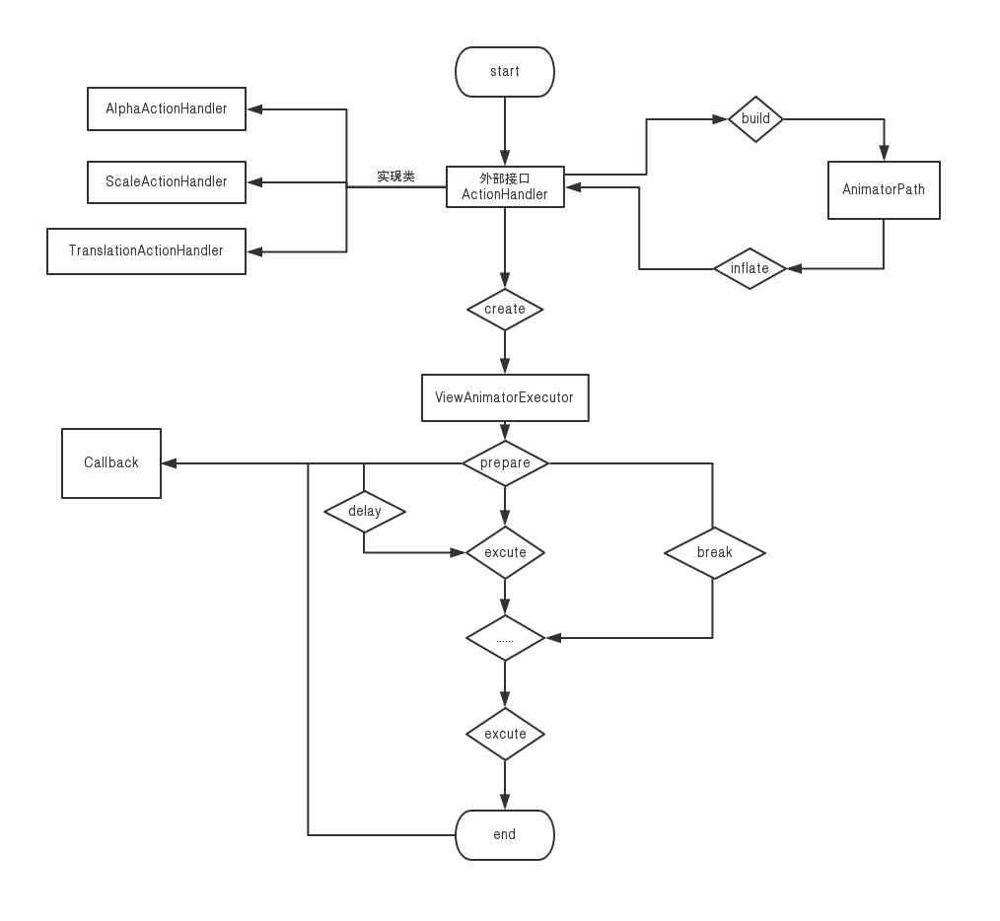

### 动画库

### 对同一view做同一种动画时，会自动取消上次的动画

### 使用方式

```
        new AlphaActionHandler()
                .setValue(1, 0.5f)
                .setInterpolator(new AccelerateDecelerateInterpolator())
                .setDuration(200)
                .setDelay(1000)
                .onViewActionOccur(view, hasFocus);

        new ScaleActionHandler()
                .setScaleType(ScaleAction.ScaleType.TYPE_CENTER_TO_CENTER)
                .setValue(1.5f)
                .setInterpolator(new AccelerateDecelerateInterpolator())
                .setDuration(200)
                .setDelay(1000)
                .onViewActionOccur(view, hasFocus);

        new TranslationActionHandler()
                .setValue(200, 0)
                .setInterpolator(new AccelerateDecelerateInterpolator())
                .setDuration(200)
                .setDelay(1000)
                .onViewActionOccur(view, hasFocus);
```

### 代码运行流程


